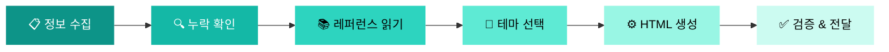

<div align="center">

# ✈️ 여행 플래너 대시보드

### *여행 정보를 아름다운 인터랙티브 HTML 대시보드로 변환합니다*

<br>

[](https://claude.ai)
[](LICENSE)
[]()
[]()
[]()
[]()

<br>

[**시작하기**](#-시작하기) · [**기능**](#-기능) · [**테마**](#-테마-시스템) · [**예제**](#-예제) · [**아키텍처**](#️-아키텍처) · [**English**](README.md)

<br>


</div>

---

<br>

## 🎯 소개

> **항공권, 호텔, 일정 데이터를 프리미엄 HTML 여행 대시보드로 자동 생성하는 Claude AI 스킬입니다.**

항공편 확인서, 호텔 예약 정보, 일별 계획을 붙여넣기만 하면 — 지도, 차트, 체크리스트, 다크/라이트 모드를 갖춘 **프로덕션 수준의 인터랙티브 단일 HTML 대시보드**가 만들어집니다.

```
📋 여행 데이터  →  🤖 Claude AI  →  🌐 아름다운 HTML 대시보드
```

<br>

<table>
<tr>
<td width="50%" valign="top">

### 💡 입력
```
목적지: 도쿄, 일본
일정: 2026년 4월 5일 ~ 4월 10일
인원: 성인 2명
숙소: 파크하얏트 도쿄 (5박)
항공: KE713 ICN→NRT 09:30-11:45
예산: 350만원
```

</td>
<td width="50%" valign="top">

### ✨ 출력
완성된 `.html` 파일에 포함되는 요소:
- 🗺️ Leaflet 인터랙티브 지도
- 📊 예산 도넛 차트
- 📅 일별 타임라인
- ✅ 상태 저장 체크리스트
- 🌙 다크/라이트 모드 토글
- 📱 완전한 반응형 디자인

</td>
</tr>
</table>

<br>

---

<br>

## 🚀 시작하기

### 요구 사항

| 항목 | 세부 사항 |
|:---|:---|
| **Claude.ai** | Claude Pro / Team / Enterprise 플랜 |
| **브라우저** | ES6를 지원하는 모든 최신 브라우저 |
| **빌드 도구** | ❌ 필요 없음 |

### 설치

3단계로 Claude.ai에 스킬을 업로드하세요:

> **1.** `travel-plan/` 폴더를 ZIP 파일로 압축합니다
>
> ⚠️ **중요:** ZIP 파일의 루트에 폴더 자체가 위치해야 합니다. 폴더 내용물만 들어 있으면 안 됩니다.
>
> ```
> travel-plan.zip
> └── travel-plan/
>     ├── SKILL.md
>     ├── examples/
>     └── references/
> ```
>
> **2.** [claude.ai](https://claude.ai) → **Settings** (좌측 하단) → **Capabilities** → 최하단 **Skills** 섹션 → **"Go to Customize"** 클릭
>
> **3.** 상단의 **"+"** 버튼 → **"Upload a skill"** → ZIP 파일을 선택합니다

✅ 완료! 모든 대화에서 스킬을 사용할 수 있습니다.

<details>
<summary><b>📥 미리 패키징된 ZIP 제공</b></summary>
<br>

이 저장소에 바로 업로드 가능한 `travel-plan.zip`이 포함되어 있습니다. 다운로드 후 바로 업로드하세요 — 별도의 압축이 필요 없습니다.

</details>

### 사용법

프로젝트 내에서 대화를 시작하고 다음 트리거 문구로 여행 정보를 전달하세요:

<table>
<tr>
<td>

**한국어 트리거**
- `여행 일정표`
- `여행 대시보드`
- `여행 일정표 만들어줘`
- `항공편이랑 호텔 정보 줄 테니 일정표 만들어줘`
- `이거 일정표로 정리해줘`

</td>
<td>

**English Triggers**
- `travel-plan`
- `travel itinerary`
- `trip planner`
- `family trip itinerary`

</td>
</tr>
</table>

생성된 `.html` 파일을 브라우저에서 열면 됩니다. 완료!

<br>

---

<br>

## ⭐ 기능

<table>
<tr>
<td align="center" width="25%">
<br>

<br><br>
<b>인터랙티브 지도</b>
<br>
<sub>Leaflet.js + OpenStreetMap 기반 이모지 마커와 클릭 가능한 장소 카드</sub>
<br><br>
</td>
<td align="center" width="25%">
<br>

<br><br>
<b>예산 차트</b>
<br>
<sub>Chart.js 도넛 차트와 카테고리별 비율 바</sub>
<br><br>
</td>
<td align="center" width="25%">
<br>

<br><br>
<b>다크 / 라이트 모드</b>
<br>
<sub>원클릭 테마 전환, localStorage 상태 유지</sub>
<br><br>
</td>
<td align="center" width="25%">
<br>

<br><br>
<b>완전 반응형</b>
<br>
<sub>모바일 퍼스트 설계와 슬라이드 아웃 사이드바</sub>
<br><br>
</td>
</tr>
</table>

<br>

### 📋 전체 섹션 구성

| # | 섹션 | 설명 | 필요 데이터 |
|:---:|:---|:---|:---|
| 1 | **사이드바 내비게이션** | 그라디언트가 적용된 고정 좌측 패널, 네비 링크, 여행 메타데이터 | 자동 생성 |
| 2 | **모바일 상단 바** | 여행 제목, 테마 토글, 햄버거 메뉴 | 자동 생성 |
| 3 | **히어로 배너** | D-Day 카운터와 통계 뱃지가 포함된 대형 그라디언트 헤더 | 목적지, 일정 |
| 4 | **개요** | 4개 KPI 카드 + 전체 일정 타임라인 요약 | 일정, 숙소 |
| 5 | **항공편 정보** | 출발/귀국 항공편 카드 (나란히 배치, 애니메이션 경로) | 항공편 상세 |
| 6 | **숙소 정보** | 어메니티 아이콘과 예약 링크가 포함된 호텔 카드 | 숙소 상세 |
| 7 | **인터랙티브 지도** | 이모지 마커와 팝업이 있는 Leaflet 지도 | 장소 좌표 |
| 8 | **일별 타임라인** | 색상 코딩된 활동과 시간대가 포함된 일별 카드 | 일별 일정 |
| 9 | **예산 & 체크리스트** | 도넛 차트 + 상태 저장 인터랙티브 체크리스트 | 비용 데이터 |
| 10 | **유용한 정보** | 시차, 환율, 날씨, 전압 정보 그리드 | 목적지 국가 |
| 11 | **비상 연락처** | 현지 긴급번호, 대사관, 병원 정보 | 목적지 국가 |
| 12 | **푸터** | 목적지와 여행자 이름이 포함된 크레딧 | 자동 생성 |

> **스마트 조립**: 데이터 유무에 따라 섹션이 자동으로 포함되거나 제외됩니다. 빈 섹션이나 불필요한 플레이스홀더가 생기지 않습니다.

<br>

### 🔄 인터랙티브 기능

```
┌─────────────────────────────────────────────────────────┐
│                                                         │
│  ScrollSpy ──── 스크롤 시 활성 네비 링크 자동 업데이트     │
│  테마 토글 ──── 다크 ↔ 라이트 전환 + 상태 유지            │
│  지도 연동 ──── 장소 카드 클릭 시 지도 포커스 이동          │
│  체크리스트 ─── localStorage로 체크 상태 저장              │
│  D-Day ──────── 출발일 기준 자동 카운트다운                │
│  모바일 네비 ── 오버레이가 있는 슬라이드 아웃 드로어         │
│                                                         │
└─────────────────────────────────────────────────────────┘
```

<br>

---

<br>

## 🎨 테마 시스템

세심하게 디자인된 6가지 테마 — 각각 **다크 모드와 라이트 모드** 변형과 **50개 이상의 CSS 변수** 포함.

<table>
<tr>
<td align="center">
  
<br><b>Coastal Teal</b>
<br><sub>해변 · 리조트 · 열대 지역</sub>
</td>
<td align="center">
  
<br><b>Urban Slate</b>
<br><sub>도쿄 · 파리 · 뉴욕</sub>
</td>
<td align="center">
  
<br><b>Forest Green</b>
<br><sub>자연 · 산 · 하이킹</sub>
</td>
</tr>
<tr>
<td align="center">
  
<br><b>Arctic Blue</b>
<br><sub>겨울 · 스키 · 북유럽</sub>
</td>
<td align="center">
  
<br><b>Warm Terracotta</b>
<br><sub>문화 · 역사 · 사찰</sub>
</td>
<td align="center">
  
<br><b>Elegant Noir</b>
<br><sub>럭셔리 · 허니문 · 부티크</sub>
</td>
</tr>
</table>

> 목적지와 여행 유형에 따라 테마가 자동 선택됩니다. 원하는 테마를 직접 지정할 수도 있습니다.

<br>

---

<br>

## 📂 예제

다양한 여행 유형을 보여주는 4개의 레퍼런스 대시보드가 포함되어 있습니다:

<table>
<tr>
<td align="center">

<br><b>도쿄 솔로</b>
<br><sub><code>tokyo-2026.html</code></sub>
<br><sub>도시 여행 · Urban Slate</sub>
</td>
<td align="center">

<br><b>도쿄 가족</b>
<br><sub><code>3-family-toyko2026.html</code></sub>
<br><sub>가족 여행 · Urban Slate</sub>
</td>
<td align="center">

<br><b>이탈리아 허니문</b>
<br><sub><code>italy-honeymoon-2026.html</code></sub>
<br><sub>허니문 · Elegant Noir</sub>
</td>
<td align="center">

<br><b>스위스 가족</b>
<br><sub><code>parents_swiss2026.html</code></sub>
<br><sub>자연 여행 · Forest Green</sub>
</td>
</tr>
</table>

> 아무 `.html` 파일이나 브라우저에서 바로 열 수 있습니다 — 서버가 필요하지 않습니다.

<br>

---

<br>

## 🏗️ 아키텍처

```
travel-planner-dashboard/
│
├── 📄 README.md                          ← English 문서
├── 📄 README.ko.md                       ← 현재 문서
├── 📜 LICENSE                            ← Apache 2.0
│
└── 📁 travel-plan/
    ├── 📄 SKILL.md                       ← 스킬 정의 & 워크플로우
    ├── 📁 examples/                      ← 레퍼런스 HTML 출력물
    │   ├── tokyo-2026.html
    │   ├── 3-family-toyko2026.html
    │   ├── italy-honeymoon-2026.html
    │   └── parents_swiss2026.html
    └── 📁 references/                    ← 디자인 시스템 문서
        ├── html-architecture.md          ← 페이지 구조 & 컴포넌트
        └── design-system.md              ← 테마 & CSS 변수
```

### 기술 스택

<table>
<tr>
<td><b>기술</b></td>
<td><b>용도</b></td>
<td><b>제공 방식</b></td>
</tr>
<tr>
<td></td>
<td>유틸리티 퍼스트 스타일링 & 반응형 레이아웃</td>
<td>CDN</td>
</tr>
<tr>
<td></td>
<td>예산 시각화 (도넛 차트)</td>
<td>CDN</td>
</tr>
<tr>
<td></td>
<td>OpenStreetMap 타일 기반 인터랙티브 지도</td>
<td>CDN</td>
</tr>
<tr>
<td></td>
<td>기본 타이포그래피 (한국어 + 라틴)</td>
<td>CDN</td>
</tr>
<tr>
<td></td>
<td>테마, 체크리스트 상태 저장</td>
<td>브라우저</td>
</tr>
</table>

<br>

### 설계 원칙

```
 ╔════════════════════════════════════════════════════════════╗
 ║                                                            ║
 ║   📦 단일 파일     모든 것이 하나의 .html 파일에              ║
 ║   🚫 빌드 불필요   npm, webpack, 컴파일 과정 없음             ║
 ║   🔒 데이터 충실   사용자 데이터를 절대 조작하지 않음           ║
 ║   📱 모바일 퍼스트  320px부터 반응형                          ║
 ║   🌐 이중 언어     한국어 & 영어 자동 감지                    ║
 ║   ♿ 접근성        시맨틱 HTML + ARIA 라벨                   ║
 ║                                                            ║
 ╚════════════════════════════════════════════════════════════╝
```

<br>

---

<br>

## 📐 출력 사양

| 항목 | 목표값 |
|:---|:---|
| **파일 크기** | 1,200 – 2,000줄 |
| **일별 타임라인 항목** | 최대 4 – 6개 |
| **사이드바 네비 항목** | 최대 8 – 12개 |
| **Chart.js 인스턴스** | 최대 1 – 2개 |
| **지도 마커** | 일반적으로 5 – 10개 |
| **외부 의존성** | CDN 라이브러리 4개만 |

<br>

---

<br>

## 📝 워크플로우



<br>

| 단계 | 작업 | 세부 사항 |
|:---:|:---|:---|
| **1** | 여행 정보 수집 | 목적지, 일정, 인원, 항공편, 숙소, 스케줄 |
| **2** | 누락 확인 & 질문 | 최대 2개의 확인 질문 후 생성 |
| **3** | 레퍼런스 읽기 | 아키텍처 & 디자인 시스템 문서 로드 |
| **4** | 테마 선택 | 목적지 유형에 맞는 6가지 테마 중 선택 |
| **5** | HTML 생성 | 섹션 조립, CSS/JS 임베드 |
| **6** | 검증 & 전달 | 안정성 체크리스트 실행, 파일 저장 & 제공 |

<br>

---

<br>

## 🤝 기여하기

기여를 환영합니다! 다음과 같은 방법으로 참여할 수 있습니다:

- **새 테마 추가** — `references/design-system.md`에 새로운 컬러 팔레트 확장
- **예제 여행 추가** — 새로운 목적지의 `.html` 출력물 제출
- **컴포넌트 개선** — `references/html-architecture.md`의 섹션 향상
- **버그 리포트** — 생성된 HTML을 첨부하여 이슈 열기

<br>

---

<br>

## 📄 라이선스

이 프로젝트는 **Apache License 2.0** 하에 라이선스됩니다 — 자세한 내용은 [LICENSE](LICENSE) 파일을 참조하세요.

<br>

---

<div align="center">


**Claude AI로 제작** · 여행자를 위해, 여행자가 만든

[맨 위로](#️-여행-플래너-대시보드)

</div>
