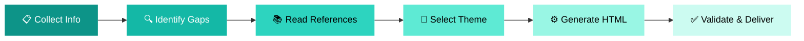

<div align="center">

# ✈️ Travel Planner Dashboard

### *Transform your travel details into stunning, interactive HTML dashboards*

<br>

[](https://claude.ai)
[](LICENSE)
[]()
[]()
[]()
[]()

<br>

[**Getting Started**](#-getting-started) · [**Features**](#-features) · [**Themes**](#-theme-system) · [**Architecture**](#-architecture) · [**한국어**](README.ko.md)

<br>


</div>

---

<br>

## 🎯 What Is This?

> **A Claude AI skill that generates premium, self-contained HTML travel dashboards from your raw booking data.**

Paste your flight confirmations, hotel reservations, and daily plans — get back a **production-grade, interactive single-file HTML dashboard** with maps, charts, checklists, and dark/light mode support.

```
📋 Your Travel Data  →  🤖 Claude AI  →  🌐 Beautiful HTML Dashboard
```

<br>

<table>
<tr>
<td width="50%" valign="top">

### 💡 Input
```
Destination: Switzerland
Dates: Aug 15 – Aug 20, 2026
Travelers: 3 (with parents in their 60s)
Hotel: Chalet 3 nights + Hotel Des Balances 1 night
Flight: SWISS LX163, LX162
Budget: ₩12,000,000
```

</td>
<td width="50%" valign="top">

### ✨ Output &nbsp; <a href="https://codepen.io/Kipeum-Lee/full/XJjgBbR"></a>
A complete `.html` file featuring:
- 🗺️ Interactive Leaflet map
- 📊 Budget doughnut chart
- 📅 Day-by-day timeline
- ✅ Persistent checklist
- 🌙 Dark/Light mode toggle
- 📱 Fully responsive design

<a href="https://codepen.io/Kipeum-Lee/full/XJjgBbR">

</a> <a href="https://codepen.io/Kipeum-Lee/full/LERLBVd">

</a>
<br>
<a href="https://codepen.io/Kipeum-Lee/full/vEXZaEz">

</a> <a href="https://codepen.io/Kipeum-Lee/full/gbwRKRz">

</a>

</td>
</tr>
</table>

<br>

---

<br>

## 🚀 Getting Started

### Prerequisites

| Requirement | Details |
|:---|:---|
| **Claude.ai** | Claude Pro / Team / Enterprise plan |
| **Browser** | Any modern browser with ES6 support |
| **Build tools** | ❌ None required |

### Installation

Upload the skill to Claude.ai in 3 steps:

> **1.** Compress the `travel-plan/` folder into a ZIP file
>
> ⚠️ **Important:** The folder itself must be at the root of the ZIP — do NOT zip only the folder's contents.
>
> ```
> travel-plan.zip
> └── travel-plan/
>     ├── SKILL.md
>     ├── examples/
>     └── references/
> ```
>
> **2.** Go to [claude.ai](https://claude.ai) → **Settings** (bottom-left) → **Capabilities** → scroll to **Skills** section → click **"Go to Customize"**
>
> **3.** Click the **"+"** button (top) → **"Upload a skill"** → select your ZIP file

✅ Done! The skill is now available across all your conversations.

<details>
<summary><b>📥 Pre-packaged ZIP available</b></summary>
<br>

A ready-to-upload `travel-plan.zip` is included in this repository. Download and upload it directly — no compression needed.

</details>

### Usage

Start a conversation in your project and provide travel details using any of these trigger phrases:

<table>
<tr>
<td>

**English Triggers**
- `travel-plan`
- `travel itinerary`
- `trip planner`
- `family trip itinerary`

</td>
<td>

**한국어 Triggers**
- `여행 일정표`
- `여행 대시보드`
- `여행 일정표 만들어줘`
- `이거 일정표로 정리해줘`

</td>
</tr>
</table>

Then open the generated `.html` file in your browser. Done.

<br>

---

<br>

## ⭐ Features

<table>
<tr>
<td align="center" width="25%">
<br>

<br><br>
<b>Interactive Maps</b>
<br>
<sub>Leaflet.js + OpenStreetMap with emoji markers and clickable place cards</sub>
<br><br>
</td>
<td align="center" width="25%">
<br>

<br><br>
<b>Budget Charts</b>
<br>
<sub>Chart.js doughnut visualization with proportional category bars</sub>
<br><br>
</td>
<td align="center" width="25%">
<br>

<br><br>
<b>Dark / Light Mode</b>
<br>
<sub>One-click theme toggle with localStorage persistence</sub>
<br><br>
</td>
<td align="center" width="25%">
<br>

<br><br>
<b>Fully Responsive</b>
<br>
<sub>Mobile-first design with slide-out sidebar navigation</sub>
<br><br>
</td>
</tr>
</table>

<br>

### 📋 Complete Section Breakdown

| # | Section | Description | Required Data |
|:---:|:---|:---|:---|
| 1 | **Sidebar Navigation** | Fixed left panel with gradient, nav links, trip metadata | Auto-generated |
| 2 | **Mobile Top Bar** | Trip title, theme toggle, hamburger menu | Auto-generated |
| 3 | **Hero Banner** | Large gradient header with D-Day counter and stat badges | Destination, dates |
| 4 | **Overview** | 4 KPI cards + timeline summary of all days | Dates, accommodation |
| 5 | **Flight Info** | Side-by-side outbound/return cards with animated paths | Flight details |
| 6 | **Accommodation** | Hotel cards with amenity icons and booking links | Hotel details |
| 7 | **Interactive Map** | Leaflet map with emoji markers and popups | Place coordinates |
| 8 | **Daily Timeline** | Per-day cards with color-coded activities and time slots | Daily schedule |
| 9 | **Budget & Checklist** | Doughnut chart + persistent interactive checklist | Cost data |
| 10 | **Useful Info** | Timezone, currency, weather, voltage grid | Destination country |
| 11 | **Emergency Contacts** | Local emergency numbers, embassy, hospital info | Destination country |
| 12 | **Footer** | Credits with destination and traveler names | Auto-generated |

> **Smart Assembly**: Sections are automatically included or omitted based on available data. No empty sections, no placeholder noise.

<br>

### 🔄 Interactive Capabilities

```
┌─────────────────────────────────────────────────┐
│                                                 │
│  ScrollSpy ─── Active nav updates on scroll     │
│  Theme Toggle ─ Dark ↔ Light with persistence   │
│  Map Pan ────── Click place cards to focus map   │
│  Checklist ──── State saved to localStorage     │
│  D-Day ──────── Auto-calculated countdown       │
│  Mobile Nav ─── Slide-out drawer with overlay    │
│                                                 │
└─────────────────────────────────────────────────┘
```

<br>

---

<br>

## 🎨 Theme System

Six carefully crafted themes — each with **dark and light mode** variants and **50+ CSS variables**.

<table>
<tr>
<td align="center">
  
<br><b>Coastal Teal</b>
<br><sub>Beach · Resort · Tropical</sub>
</td>
<td align="center">
  
<br><b>Urban Slate</b>
<br><sub>Tokyo · Paris · NYC</sub>
</td>
<td align="center">
  
<br><b>Forest Green</b>
<br><sub>Nature · Mountain · Hiking</sub>
</td>
</tr>
<tr>
<td align="center">
  
<br><b>Arctic Blue</b>
<br><sub>Winter · Ski · Northern</sub>
</td>
<td align="center">
  
<br><b>Warm Terracotta</b>
<br><sub>Cultural · Historical · Temple</sub>
</td>
<td align="center">
  
<br><b>Elegant Noir</b>
<br><sub>Luxury · Honeymoon · Boutique</sub>
</td>
</tr>
</table>

> Themes are automatically selected based on your destination and trip type. Override by specifying your preference.

<br>

---

<br>

## 🏗️ Architecture

```
travel-planner-dashboard/
│
├── 📄 README.md                          ← You are here
├── 📄 README.ko.md                       ← 한국어 문서
├── 📜 LICENSE                            ← Apache 2.0
│
└── 📁 travel-plan/
    ├── 📄 SKILL.md                       ← Skill definition & workflow
    ├── 📁 examples/                      ← Reference HTML outputs
    │   ├── tokyo-2026.html
    │   ├── 3-family-toyko2026.html
    │   ├── italy-honeymoon-2026.html
    │   └── parents_swiss2026.html
    └── 📁 references/                    ← Design system docs
        ├── html-architecture.md          ← Page structure & components
        └── design-system.md              ← Themes & CSS variables
```

### Tech Stack

<table>
<tr>
<td><b>Technology</b></td>
<td><b>Purpose</b></td>
<td><b>Delivery</b></td>
</tr>
<tr>
<td></td>
<td>Utility-first styling & responsive layout</td>
<td>CDN</td>
</tr>
<tr>
<td></td>
<td>Budget visualization (doughnut charts)</td>
<td>CDN</td>
</tr>
<tr>
<td></td>
<td>Interactive maps with OpenStreetMap tiles</td>
<td>CDN</td>
</tr>
<tr>
<td></td>
<td>Primary typography (Korean + Latin)</td>
<td>CDN</td>
</tr>
<tr>
<td></td>
<td>Persist theme, checklist state</td>
<td>Browser</td>
</tr>
</table>

<br>

### Design Principles

```
 ╔══════════════════════════════════════════════════════╗
 ║                                                      ║
 ║   📦 SINGLE FILE    Everything in one .html file     ║
 ║   🚫 NO BUILD       Zero npm, webpack, compilation   ║
 ║   🔒 DATA FIDELITY  Never fabricate user data        ║
 ║   📱 MOBILE FIRST   Responsive from 320px up         ║
 ║   🌐 BILINGUAL      Korean & English auto-detect     ║
 ║   ♿ ACCESSIBLE     Semantic HTML + ARIA labels       ║
 ║                                                      ║
 ╚══════════════════════════════════════════════════════╝
```

<br>

---

<br>

## 📐 Output Specifications

| Metric | Target |
|:---|:---|
| **File size** | 1,200 – 2,000 lines |
| **Timeline items/day** | 4 – 6 max |
| **Sidebar nav items** | 8 – 12 max |
| **Chart.js instances** | 1 – 2 max |
| **Map markers** | 5 – 10 typical |
| **External dependencies** | 4 CDN libraries only |

<br>

---

<br>

## 📝 Workflow



<br>

| Step | Action | Details |
|:---:|:---|:---|
| **1** | Collect travel info | Destination, dates, travelers, flights, hotels, schedule |
| **2** | Identify gaps & confirm | Ask ≤ 2 clarifying questions, then generate |
| **3** | Read references | Load architecture & design system docs |
| **4** | Select theme | Match destination type to one of 6 themes |
| **5** | Generate HTML | Assemble sections, embed all CSS/JS |
| **6** | Validate & deliver | Run stability checklist, save & present file |

<br>

---

<br>

## 🤝 Contributing

Contributions are welcome! Here's how you can help:

- **Add new themes** — Extend `references/design-system.md` with new color palettes
- **Add example trips** — Submit `.html` outputs for new destinations
- **Improve components** — Enhance sections in `references/html-architecture.md`
- **Report bugs** — Open an issue with the generated HTML attached

<br>

---

<br>

## 📄 License

This project is licensed under the **Apache License 2.0** — see the [LICENSE](LICENSE) file for details.

<br>

---

<div align="center">


**Built with Claude AI** · Made for travelers, by travelers

[Back to Top](#️-travel-planner-dashboard)

</div>
